# Architecture Diagram Source

This file contains the Mermaid diagram source code for the SGEPT API Integration architecture.

## How to Generate SVG

**Option 1: GitHub (Automatic)**
- GitHub automatically renders Mermaid diagrams in markdown files
- Simply view this file on GitHub to see the rendered diagram

**Option 2: Mermaid Live Editor**
1. Go to [https://mermaid.live/](https://mermaid.live/)
2. Copy the code below into the editor
3. Export as SVG/PNG as needed

**Option 3: VS Code Extension**
1. Install "Mermaid Markdown Syntax Highlighting" extension
2. View this file in VS Code with preview
3. Export as needed

## Mermaid Diagram Source Code

```mermaid
graph TD
    %% External Systems
    API["🌐 SGEPT API<br/>api.globaltradealert.org<br/>/api/v1/data/"]
    SCHED["⏰ Windows Task Scheduler<br/>(Optional Automation)"]
    
    %% User Interaction
    USER["👤 User<br/>Runs: SyncGTA"]
    
    %% VBA Components  
    VBA_JSON["📄 JsonConverter.bas<br/>VBA-JSON Library<br/>(Tim Hall)"]
    VBA_SYNC["📄 modGtaSync.bas<br/>Main Sync Logic<br/>API Integration"]
    
    %% Access Database
    subgraph ACCESS ["🗃️ Microsoft Access Database (GtaDemo.accdb)"]
        TBL_SETTINGS["⚙️ tblSettings<br/>• API Key<br/>• Page Size<br/>• Sync Preferences"]
        TBL_INTERVENTIONS["📊 tblGTAInterventions<br/>• Intervention Data<br/>• 15+ Fields<br/>• MAST Chapter D Focus"]
        TBL_LOG["📝 tblSyncLog<br/>• Change Tracking<br/>• Session History<br/>• Error Logs"]
    end
    
    %% Queries and Reports
    QUERIES["📈 Pre-Built Queries<br/>• Recent Interventions<br/>• By Jurisdiction<br/>• Trade Defense Measures<br/>• Sync Performance"]
    
    %% Data Flow
    USER -->|"1. Executes"| VBA_SYNC
    SCHED -.->|"Optional: Automated Trigger"| VBA_SYNC
    
    VBA_SYNC -->|"2. Reads Config"| TBL_SETTINGS
    VBA_SYNC -->|"3. HTTP POST Request<br/>JSON Payload"| API
    API -->|"4. JSON Response<br/>Intervention Data"| VBA_SYNC
    
    VBA_SYNC -->|"5. Uses"| VBA_JSON
    VBA_JSON -->|"6. Parsed Data"| VBA_SYNC
    
    VBA_SYNC -->|"7. Insert/Update Records<br/>Smart Change Detection"| TBL_INTERVENTIONS
    VBA_SYNC -->|"8. Log Operations"| TBL_LOG
    
    TBL_INTERVENTIONS -->|"9. Data Source"| QUERIES
    TBL_LOG -->|"Audit Trail"| QUERIES
    
    %% Styling
    classDef external fill:#e1f5fe
    classDef vba fill:#fff3e0  
    classDef database fill:#f3e5f5
    classDef user fill:#e8f5e8
    
    class API,SCHED external
    class VBA_JSON,VBA_SYNC vba
    class TBL_SETTINGS,TBL_INTERVENTIONS,TBL_LOG database
    class USER,QUERIES user
```

## Diagram Description

This architecture diagram illustrates the complete SGEPT API integration system with the following key elements:

### Components
- **External API**: SGEPT REST API providing trade intervention data
- **VBA Modules**: JsonConverter.bas (JSON library) and modGtaSync.bas (main logic)
- **Database Tables**: Settings, interventions data, and sync logs
- **User Interface**: Pre-built queries and manual/automated sync triggers

### Data Flow (9 Steps)
1. User executes sync command or Task Scheduler triggers automation
2. System reads configuration from settings table
3. HTTP POST request sent to SGEPT API with MAST Chapter D filter
4. API returns JSON response with intervention data
5. VBA uses JsonConverter to parse response
6. Parsed data returned to main sync logic
7. Smart insert/update logic processes records based on change detection
8. All operations logged to audit table
9. Data becomes available through pre-built analytical queries

### Color Coding
- **Blue**: External systems (API, Task Scheduler)
- **Orange**: VBA components (code modules)
- **Purple**: Database components (Access tables)
- **Green**: User-facing elements (user interaction, queries)

The diagram emphasizes the bidirectional data flow and the optional automation capability while highlighting the comprehensive logging and change tracking features. 